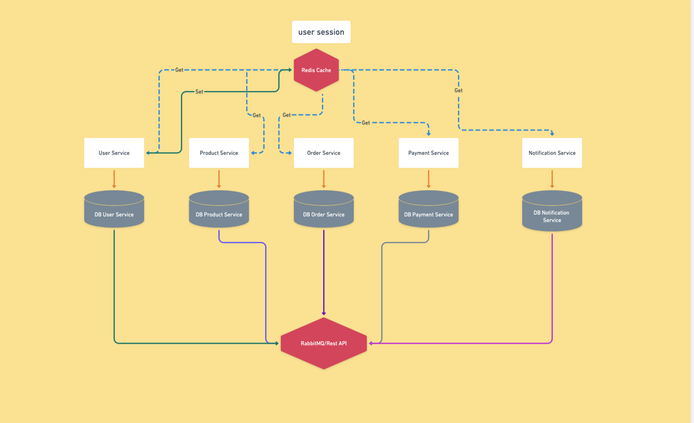

# 🛒 Microservices Grocery Delivery

Sistem backend pengiriman bahan makanan (grocery delivery) yang dibangun dengan arsitektur **microservices** menggunakan **Go (Golang)**. Setiap service berjalan secara independen dan berkomunikasi satu sama lain melalui **gRPC** dan **RabbitMQ**.

[](https://golang.org/)
[](https://www.docker.com/)
[](https://grpc.io/)
[](https://www.rabbitmq.com/)
[](https://www.postgresql.org/)
[](https://documenter.getpostman.com/view/47767603/2sB3HkrM7n)

---

## 📋 Daftar Isi

- [Arsitektur](#-arsitektur)
- [Daftar Services](#-daftar-services)
- [Tech Stack](#-tech-stack)
- [Struktur Folder](#-struktur-folder)
- [Infrastruktur](#-infrastruktur)
- [Cara Menjalankan](#-cara-menjalankan)
- [Dokumentasi API](#-dokumentasi-api)
- [Load Testing](#-load-testing)

---

## 🏛️ Arsitektur



Semua service terhubung ke **PostgreSQL** sebagai database utama, **Redis** untuk caching, dan berkomunikasi secara asinkron menggunakan **RabbitMQ**.

---

## 📦 Daftar Services

### 1. 🔀 API Gateway (`/api-gateway`)

Pintu masuk utama seluruh request dari client. Bertanggung jawab untuk:

- Routing request ke service yang tepat
- Validasi dan autentikasi JWT token
- Rate limiting

### 2. 👤 User Service (`/user-service`)

Mengelola data pengguna dan autentikasi:

- Auth dan OAuth
- Manajemen profil
- Generate & validasi JWT token
- Caching sesi dengan **Redis**

### 3. 🛍️ Product Service (`/product-service`)

Mengelola katalog produk bahan makanan:

- CRUD produk (nama, harga, stok, kategori)
- Pencarian produk dengan **Elasticsearch**
- Manajemen inventori

### 4. 📦 Order Service (`/order-service`)

Mengelola proses pemesanan:

- Buat, lihat, dan update pesanan
- Kalkulasi total harga
- Publish event ke **RabbitMQ** setelah order dibuat
- Komunikasi dengan Product & Payment Service via **REST**, **RabbitMQ** dan **gRPC**

### 5. 💳 Payment Service (`/payment-service`)

Menangani proses pembayaran:

- Proses transaksi pembayaran
- Update status pembayaran
- Subscribe event dari Order Service via **RabbitMQ**
- Notifikasi ke Notification Service setelah pembayaran berhasil

### 6. 🔔 Notification Service (`/notification-service`)

Mengirimkan notifikasi kepada pengguna:

- Kirim email/notifikasi konfirmasi order
- Kirim notifikasi status pembayaran
- Subscribe event dari RabbitMQ secara asinkron

---

## 🛠️ Tech Stack

| Kategori                 | Teknologi                      |
| ------------------------ | ------------------------------ |
| Bahasa                   | Go (Golang)                    |
| Komunikasi Antar Service | REST & gRPC (Protocol Buffers) |
| Message Broker           | RabbitMQ                       |
| Database                 | PostgreSQL 15                  |
| Caching                  | Redis                          |
| Containerization         | Docker & Docker Compose        |
| API Documentation        | Postman                        |

---

## 📁 Struktur Folder

```
microservices-grocery-delivery/
├── api-gateway/            # API Gateway service
├── user-service/           # User & autentikasi service
├── product-service/        # Produk & inventori service
├── order-service/          # Order management service
├── payment-service/        # Payment processing service
├── notification-service/   # Notification service
├── proto/                  # Protobuf definitions (gRPC contracts)
└── docker-compose.yml      # Konfigurasi seluruh infrastruktur
```

---

## 🏗️ Infrastruktur

Seluruh infrastruktur dijalankan melalui `docker-compose.yml`:

| Service    | Image                   | Port                 |
| ---------- | ----------------------- | -------------------- |
| PostgreSQL | `postgres:15`           | `5432`               |
| Redis      | `redis:latest`          | `6379`               |
| RabbitMQ   | `rabbitmq:3-management` | `5672`, `15672` (UI) |

> **RabbitMQ Management UI** dapat diakses di `http://localhost:15672` dengan username `guest` dan password `guest`.

---

## 🚀 Cara Menjalankan

### Prasyarat

- [Go 1.21+](https://golang.org/dl/)
- [Docker](https://www.docker.com/get-started) & Docker Compose
- [protoc](https://grpc.io/docs/protoc-installation/) (untuk generate ulang proto)

### 1. Clone Repository

```bash
git clone https://github.com/abdultalif/microservices-grocery-delivery.git
cd microservices-grocery-delivery
```

### 2. Jalankan Infrastruktur

```bash
docker-compose up -d
```

Perintah ini akan menjalankan PostgreSQL, Redis, RabbitMQ, dan Elasticsearch.

### 3. Jalankan Setiap Service dan Worker

Buka terminal terpisah untuk masing-masing service:

```bash
# API Gateway
cd api-gateway && go run main.go

# User Service
cd user-service && go run main.go

# Product Service
cd product-service && go run main.go

# Order Service
cd order-service && go run main.go

# Payment Service
cd payment-service && go run main.go

# Notification Service
cd notification-service && go run main.go
```

### 4. Verifikasi Infrastruktur Berjalan

```bash
# Cek status container
docker-compose ps

# Cek kesehatan Elasticsearch
curl http://localhost:9200/_cluster/health

# Cek RabbitMQ
curl http://localhost:15672
```

---

## 📚 Dokumentasi API

Dokumentasi lengkap seluruh endpoint API beserta contoh request dan response tersedia di Postman:

[](https://documenter.getpostman.com/view/47767603/2sB3HkrM7n)
